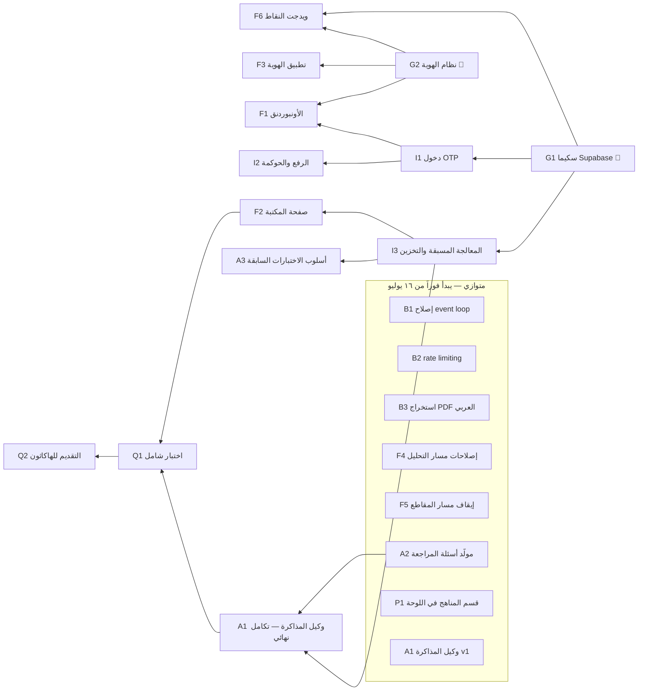

# خطة إيضاح — سبرينت الهاكاثون (١٦ → ٢٥ يوليو ٢٠٢٦)

> هذا الملف هو **المصدر الوحيد للسياق**. أي عضو (أو وكيل ذكاء اصطناعي يشغّله العضو) يقدر يفتح هذا الملف + بطاقة المهمة في GitHub ويشتغل مستقلاً بدون ما يسأل أحد.
> مكانه في المستودع: `docs/HACKATHON_PLAN.md`

---

## ١ · السياق الكامل للمشروع

**إيضاح** منصة تعليمية عربية بالذكاء الاصطناعي من فريق نادي إنجاز (جامعة الإمام محمد بن سعود الإسلامية).

- **المستودع الرسمي:** github.com/Turki-Aldaajani/Eidaah — المشاركة مفتوحة: أي عضو ياخذ المهمة اللي تناسبه (self-assign) ويرفع PR.
- **الموقع الحالي:** eidaah-jgqp.vercel.app — صفحة رئيسية تعريفية (سلوقن) تتفرع لمسارين:
  1. **مسار المناهج التعليمية** (الجديد): الطالب يختار مرحلته ويوصل لمحتوى جاهز.
  2. **مسار «حلّل ملفاتك العلمية»** (إيضاح القديم): رفع ملف ← شرح وملخص وأمثلة. يُطوَّر بالتوازي.
- **الستاك:** React (فرونت) · FastAPI + Groq API (تحليل بالذكاء الاصطناعي) · Vercel (نشر) · **Supabase** (قرار جديد: تسجيل دخول + قاعدة بيانات).
- **لوحة الملاحظات:** eidaah-plan.vercel.app (Firestore) — لالتقاط الأفكار والملاحظات فقط. التنفيذ هنا في GitHub.

**قرارات متخذة (من نقاش الفريق — لا تُعاد مناقشتها ضمن هذا السبرينت):**
1. **إلغاء الاعتماد على مقاطع اليوتيوب** في مسار المناهج (جودة الترجمة تلخبط النموذج) — الاعتماد على الملفات النصية.
2. **الطلاب يرفعون المقررات بأنفسهم** بدل إدخال البيانات يدوياً منا (استدامة + تفادي scope creep)، مع **حوكمة**: الرفع يدخل كطلب، وأدمن يوافق قبل النشر.
3. **الميزة التنافسية:** منصات المناهج الحالية (عين، منهجي) ما فيها ذكاء اصطناعي — إيضاح يضيفه.
4. **الهدف الاستراتيجي للهاكاثون:** تحويل إيضاح من «أداة» تنفذ أمراً واحداً إلى **«وكيل»** يخطط وينفذ حلقة مذاكرة كاملة بنفسه.

**الهاكاثون:** آخر موعد للتقديم **٢٥ يوليو ٢٠٢٦**. المسؤول عن التقديم يتحقق من المتطلبات الرسمية (فيديو؟ عرض؟ رابط تجريبي؟) ويحدّثها في المهمة Q2 أول يوم.

---

## ٢ · قواعد اللعب

1. المهام موزعة على **الفرق لا الأشخاص** — خذ ما يناسبك بـ self-assign من لوحة GitHub Project.
2. كل مهمة = فرع مستقل باسم واضح (مثال: feat/g1-supabase-schema) ← PR يذكر "Closes #رقم المهمة".
3. لا تبدأ مهمة **متسلسلة** قبل إقفال اعتمادياتها. المهام الموسومة "متوازي" تبدأ من اليوم الأول.
4. علقت أكثر من ساعتين؟ اكتب تعليقاً على الـ Issue واسحب مهمة متوازية ثانية — لا أحد ينتظر أحداً.
5. **تجميد الميزات مساء ٢٣ يوليو.** بعدها إصلاحات واختبار وتقديم فقط.

---

## ٣ · خريطة الاعتماديات (وش متوازي ووش متسلسل)



**قراءة الخريطة:** مفتاحا البداية G1 وG2 (يُنجزان خلال أول ٤٨ ساعة لأنهما يفتحان الباقي). كل صندوق داخل «متوازي» يبدأ فوراً بدون انتظار. Q2 يبدأ تجهيزه مبكراً (سكربت العرض) لكن إقفاله آخر شيء.

---

## ٤ · الجدول الزمني (٩ أيام)

| الأيام | التركيز |
|---|---|
| ١٦–١٧ يوليو | إنجاز البوابتين G1 + G2 · انطلاق كل المهام المتوازية (B1–B3، F4، F5، A2، P1، وA1 نسخة أولى فوق مسار التحليل الحالي) |
| ١٨–٢٠ يوليو | I1 (دخول OTP) ← ثم F1 (أونبوردنق) · I3 (المعالجة المسبقة) · F3 (الهوية على الصفحات) |
| ٢١–٢٢ يوليو | F2 (المكتبة) · I2 (الحوكمة) · F6 (النقاط) · تكامل A1 النهائي مع المكتبة والأسئلة |
| ٢٣ يوليو | 🧊 تجميد الميزات مساءً · Q1 اختبار شامل وإصلاحات |
| ٢٤–٢٥ يوليو | Q2: الفيديو والعرض والتقديم الرسمي قبل الإغلاق |

---

## ٥ · بطاقات المهام

كل بطاقة تحتوي ما يكفي للعمل المستقل. الأولوية: **MUST** (بدونها ما فيه عرض) · **SHOULD** (تقوّي العرض) · **STRETCH** (إذا فاض وقت).

### 🔑 البوابات — أول ٤٨ ساعة

**G1 · سكيما Supabase** — ⚙️ باك اند · MUST · بوابة
إنشاء مشروع Supabase وتعريف الجداول: profiles (جامعة/كلية/تخصص/مستوى)، materials (المواد المعتمدة + حالة المعالجة)، material_requests (طلبات الرفع: pending/approved/rejected)، points_ledger (رصيد النقاط وأسبابها). تفعيل Row Level Security بسياسة مبدئية: القراءة عامة للمواد المعتمدة، والكتابة للمسجلين.
✅ القبول: مفاتيح البيئة في .env.example، والجداول تشتغل من الواجهة بعمليتي قراءة وكتابة تجريبيتين.

**G2 · نظام الهوية البصرية** — 🎨 UI/UX · MUST · بوابة
استخراج هوية نادي إنجاز (ألوان، خطوط، شعار) وتحويلها إلى توكنز CSS جاهزة (variables) + نماذج المكونات الأساسية: زر، بطاقة، حقل إدخال، شاشة أونبوردنق. تُسلَّم كملف Figma أو صفحة HTML مرجعية داخل الريبو.
✅ القبول: ملف tokens.css في الريبو + موافقة الفريق على العينة في تعليق على الـ Issue.

### ⚙️ البنية التحتية — متسلسلة بعد G1

**I1 · تسجيل الدخول برمز OTP عبر الإيميل** — ⚙️ باك اند · MUST · يعتمد على G1
Supabase Auth بوضع Magic Link/OTP: المستخدم يدخل إيميله (الجامعي أولوية) ويستلم رمزاً — بدون باسوورد وبدون أي بيانات إضافية (مبدأ تقليل البيانات). التحقق من نطاق الإيميل الجامعي يفتح مكتبة الجامعة، وأي إيميل آخر يدخل بالتجربة الحرة.
✅ القبول: دورة دخول/خروج كاملة تعمل، والجلسة تبقى بعد إعادة تحميل الصفحة.

**I2 · رفع المواد كطلبات + موافقة الأدمن (الحوكمة)** — ⚙️ باك اند + 🖥️ فرونت · SHOULD · يعتمد على I1
نموذج «أضف مقرراً» يرفع الملف إلى Supabase Storage ويسجل طلباً بحالة pending، وصفحة أدمن بسيطة (محمية بقائمة إيميلات الأدمن) تعرض الطلبات مع زري قبول/رفض. القبول ينقل المادة إلى materials ويطلق معالجة I3.
✅ القبول: سيناريو كامل: طالب يرفع ← أدمن يوافق ← المادة تظهر بالمكتبة.

**I3 · المعالجة المسبقة والتخزين (أساس التوسع)** — ⚙️ باك اند + 🤖 AI · MUST · يعتمد على G1
الملف المعتمد يُعالج **مرة واحدة** (استخراج نص + شرح + ملخص لكل شريحة عبر خط التحليل الحالي) وتُخزَّن النتائج في Supabase مرتبطة بالمادة. أي طالب بعدها يستهلك النتائج المخزنة بدون أي استدعاء جديد لـ Groq — هذا اللي يخلي المشروع يتوسع بدون ما يحترق رصيد الـ API.
✅ القبول: فتح مادة معالجة لا يستدعي Groq إطلاقاً (يُثبت من اللوق)، ومادتان حقيقيتان على الأقل جاهزتان للديمو.

### 🖥️ الواجهة

**F1 · الأونبوردنق السياقي** — 🖥️ فرونت · MUST · يعتمد على I1 وG2 (الواجهة تُبنى بموك من اليوم الأول)
بعد أول تسجيل دخول: أسئلة قصيرة قابلة للتخطي (Skip) — الجامعة، الكلية، التخصص، المستوى — تُحفظ في profiles وتُعدَّل لاحقاً من الإعدادات (شرط ليان لتفادي انحصار المستخدم بخيار خاطئ). النتيجة: الطالب يهبط مباشرة على مواد مستواه.
✅ القبول: مستخدم جديد يكمل أو يتخطى الأونبوردنق، ويقدر يعدل بياناته من الإعدادات وتنعكس فوراً.

**F2 · صفحة المكتبة** — 🖥️ فرونت · MUST · يعتمد على I3
عرض مواد الجامعة مفلترة تلقائياً حسب بيانات الأونبوردنق، وفتح المادة يعرض الشرائح والشرح المخزن مسبقاً بنفس تجربة صفحة النتائج الحالية.
✅ القبول: من الدخول إلى شرح أول شريحة بأقل من ٣ نقرات وبدون رفع أي ملف.

**F3 · تطبيق الهوية على الصفحات الحالية** — 🖥️ فرونت · MUST · يعتمد على G2
تطبيق توكنز G2 على الصفحة الرئيسية (السلوقن) والمسارين بحيث يطلع الموقع بهوية إنجاز موحدة يوم العرض.
✅ القبول: مطابقة بصرية للنماذج المعتمدة في G2 على الجوال والكمبيوتر.

**F4 · إصلاحات مسار التحليل العاجلة** — 🖥️ فرونت · SHOULD · متوازي
من لوحة الملاحظات، الثلاثة المؤثرة بالعرض فقط: (١) تنقّل الشرائح برقم «٣ / ١٢» وأسهم بدل تراص الصور المصغرة، (٢) التحقق أن لغة المستخدم تُمرَّر فعلاً للنموذج في النسخة المدموجة، (٣) التحقق من سلامة العرض على الجوال. بقية بنود اللوحة لها مهام مستقلة في قسم «الإصلاحات المكملة» أدناه — ما نترك شيئاً.
✅ القبول: الثلاثة تشتغل على eidaah-jgqp.vercel.app بعد الدمج.

**F5 · إيقاف مسار المقاطع** — 🖥️ فرونت · MUST · متوازي (صغيرة)
تنفيذ قرار الإلغاء: إزالة/إخفاء واجهات مقاطع اليوتيوب من مسار المناهج وتوجيه التجربة نحو الملفات المعالجة، بدون كسر أي روابط.
✅ القبول: لا يظهر أي محتوى فيديو في المسار، والتنقل سليم.

**F6 · ويدجت النقاط والمستويات** — 🖥️ فرونت · SHOULD · يعتمد على G1 وG2
النطاق الضيق المتفق عليه: الطالب يكسب نقاطاً عند إكمال شرح مادة أو جولة أسئلة (تسجَّل في points_ledger)، وويدجت بالهيدر يعرض الرصيد والمستوى (٣ مستويات). دعوة الأصدقاء والتنافس: خارج نطاق هذا السبرينت.
✅ القبول: إكمال جولة أسئلة يزيد الرصيد فوراً ويظهر في الويدجت.

### 🤖 الذكاء الاصطناعي

**A1 · وكيل المذاكرة (نجم العرض)** — 🤖 AI · MUST · نسخة أولى متوازية، والتكامل النهائي يعتمد على A2 وI3
طبقة orchestration فوق قدرات إيضاح تحوّله من أداة إلى وكيل: الطالب يكتب هدفاً («جهزني لاختبار مادة كذا بعد ٣ أيام»)، والوكيل يخطط وينفذ بنفسه حلقة كاملة — يجلب المادة من المكتبة ← يشرح ← يولّد أسئلة (A2) ← يصحح ← يحدد نقاط الضعف ← يعيد الشرح والاختبار عليها، ويعرض خطته وتقدمه للطالب خطوة بخطوة. النسخة الأولى تشتغل فوق مسار التحليل الحالي (ملف مرفوع)، والنهائية فوق المكتبة.
✅ القبول: ديمو متواصل من كتابة الهدف إلى تقرير نهائي بنقاط القوة والضعف بدون أي تدخل يدوي بين الخطوات.

**A2 · مولّد أسئلة المراجعة** — 🤖 AI · MUST · متوازي
Endpoint يستقبل محتوى شرائح ويرجع ٣–٥ أسئلة اختيار من متعدد بلغة المستخدم، مع الإجابة الصحيحة وتعليل قصير، بصيغة JSON ثابتة تستهلكها الواجهة وA1.
✅ القبول: أسئلة صحيحة ومتنوعة على مادتي الديمو، عربي وإنجليزي.

**A3 · محاكاة أسلوب الاختبارات السابقة** — 🤖 AI · STRETCH · يعتمد على I3
فكرة ريان: تلقيم النموذج نماذج اختبارات سابقة (من البوكس) كأمثلة few-shot ليولّد أسئلة بنفس أسلوب المادة الفعلي.
✅ القبول: مقارنة جنباً إلى جنب تُظهر فرقاً واضحاً بالأسلوب مع وبدون النماذج.

**A4 · عنوان ووصف تلقائي للمستند** — 🤖 AI · STRETCH · متوازي
عند معالجة أي ملف، توليد عنوان ووصف مختصر يظهران أعلى صفحة النتائج والمكتبة.
✅ القبول: يظهران لكل مادة معالجة بدون استدعاء إضافي عند كل فتح.

### ⚙️ إصلاحات الباك اند — متوازية كلها

**B1 · إصلاح حجب الـ event loop** — ⚙️ باك اند · MUST
استدعاء Groq الحالي synchronous داخل async endpoint فيبطئ السيرفر مع تعدد الطلبات — الحل: عميل Groq غير المتزامن أو run_in_executor.
✅ القبول: طلبان متزامنان لا يحجب أحدهما الآخر (اختبار asyncio.gather).

**B2 · Rate limiting** — ⚙️ باك اند · MUST (صارت أهم مع فتح التسجيل للعموم)
حد للطلبات لكل مستخدم/IP عبر slowapi مع رد 429 برسالة عربية واضحة تعرضها الواجهة.
✅ القبول: تجاوز الحد يرجع 429 ولا يستدعي Groq.

**B3 · استخراج النص العربي من PDF** — ⚙️ باك اند · SHOULD
معالجة مشكلتي الترتيب البصري (حروف مقلوبة) وخلط الفقرات في التخطيطات متعددة الأعمدة، مع مجلد tests/fixtures فيه ملفات عربية حقيقية للتحقق. جودة الاستخراج أساس جودة كل شيء فوقها.
✅ القبول: ملفات الاختبار تخرج بنص عربي سليم الترتيب عبر pytest.

### 🔧 الإصلاحات المكملة — بقية بنود اللوحة كاملة (متوازية · مثالية كأول مهمة لأي عضو)

كلها تبدأ فوراً بدون اعتماديات ما لم يُذكر غير ذلك. الموسومة «good first issue» صغيرة ومناسبة لأي عضو يبي ينطلق بسرعة أو يجرب سير العمل.

**N1 · توحيد إدارة اللغة (Context API)** — 🖥️ فرونت · SHOULD
كل صفحة تقرأ localStorage بشكل منفصل فتغيير اللغة لا ينعكس على البقية. مصدر واحد للغة عبر Context.
✅ القبول: تغيير اللغة من أي صفحة يحدّث كل الصفحات فوراً. (يُكمل جزء اللغة في F4)

**N2 · تفعيل السحب والإفلات في الرفع** — 🖥️ فرونت · SHOULD · good first issue
الصندوق يوحي بالخاصية (إطار متقطع) وهي غير مفعلة — فعّلها أو عدّل التصميم.
✅ القبول: إفلات ملف على الصندوق يرفعه فعلاً.

**N3 · إجابات FAQ تتمدد ديناميكياً** — 🖥️ فرونت · SHOULD · good first issue
الارتفاع مثبت على 100px فيقطع الإجابات الطويلة.
✅ القبول: أطول إجابة تظهر كاملة على الجوال والكمبيوتر.

**N4 · استبدال نص placeholder في FAQ** — 🖥️ فرونت · SHOULD · good first issue
نص «ضع هنا إيميل أو رابط» ما زال ظاهراً في سؤال «وجدت مشكلة».
✅ القبول: الإيميل الرسمي ظاهر مكانه.

**N5 · مسح رسالة الخطأ عند إعادة المحاولة** — 🖥️ فرونت · SHOULD · good first issue
بعد خطأ، الضغط على «شرح» مجدداً يُبقي رسالة الخطأ ظاهرة مع التحميل.
✅ القبول: بدء محاولة جديدة يخفي رسالة الخطأ فوراً.

**N6 · توحيد عرض الـ Footer** — 🖥️ فرونت · SHOULD · good first issue
عرض الـ Footer‏ 900 بينما حاوية النتائج 1200 — يبدو غير متناسق.
✅ القبول: العرضان موحدان بصرياً.

**N7 · إزالة تكرار العنوان الفرعي في صفحة الرفع** — 🖥️ فرونت · SHOULD · good first issue
لكل ميزة title وsubtitle بنفس النص.
✅ القبول: نصوص متمايزة أو حذف التكرار بعد مراجعة المحتوى.

**N8 · تحذير عند اقتطاع النص** — ⚙️ باك اند · SHOULD
النص يُقتطع عند 3000 حرف بصمت وقد يضيع محتوى مهم.
✅ القبول: رفع الحد بأمان أو إرجاع warning ضمن الاستجابة تعرضه الواجهة للمستخدم.

**N9 · التحقق من ImportError وإقفال البند** — ⚙️ باك اند · SHOULD · good first issue
الملاحظة كانت على Model.py القديم والبنية الجديدة على ai_logic.py — الأرجح أنها انحلت ضمنياً.
✅ القبول: السيرفر يقلع نظيفاً، وتعليق على المهمة بالدليل، وإقفال البند في لوحة الملاحظات.

**N10 · قسم المزايا البصري في الرئيسية** — 🎨 UI/UX + 🖥️ فرونت · SHOULD · يعتمد على G2
عرض مزايا إيضاح (التحليل الذكي، الأمثلة، الأسئلة...) بصور توضيحية أو فيديو قصير لكل ميزة بهوية إنجاز.
✅ القبول: تصميم معتمد من UI/UX ثم تنفيذ مطابق له.

**N11 · ملاحظات المتحدث (Speaker Notes)** — 🤖 AI · STRETCH
توليد ملاحظات للمقدّم لكل شريحة — آخر بند متبقٍ من اللوحة.
✅ القبول: زر يعرض ملاحظات ملائمة لمادتي الديمو.

### 🧪 الاختبار والتقديم

**Q1 · الاختبار الشامل** — 🧪 QA · MUST · بعد تجميد الميزات (٢٣ يوليو)
سيناريوهات end-to-end: دخول OTP، أونبوردنق وتعديل من الإعدادات، رفع ← موافقة ← ظهور بالمكتبة، جولة وكيل كاملة، والجوال. الأخطاء تُسجَّل Issues بليبل bug وتُصلح فوراً.
✅ القبول: كل السيناريوهات خضراء على النسخة المنشورة.

**Q2 · التقديم للهاكاثون** — 📌 عام · MUST · التجهيز يبدأ مبكراً والإقفال آخر مهمة
أول يوم: التحقق من متطلبات التقديم الرسمية وتحديث هذه البطاقة بها. ثم: سكربت ديمو (٣ دقائق) قصته «إيضاح تحوّل من أداة إلى وكيل مذاكرة»، تسجيل الفيديو، تجهيز العرض، والتقديم قبل إغلاق ٢٥ يوليو.
✅ القبول: التقديم مرسل ومؤكد قبل الموعد النهائي.

**P1 · قسم المناهج التعليمية في لوحة الملاحظات** — 📌 عام · SHOULD · متوازي (صغيرة)
تنفيذ طلب القروب: إضافة تصنيف/قسم «منهج تعليمي» في eidaah-plan بحيث تتجمع ملاحظات هذا القسم في مكان واحد، مع الإبقاء على بقية الأقسام كما هي.
✅ القبول: يمكن إضافة ملاحظة مصنفة «منهج تعليمي» وفلترة اللوحة عليها.

---

## ٦ · تنفيذ مهمة بوكيل ذكاء اصطناعي (Claude Code أو غيره)

أي عضو يقدر يوكّل مهمته لوكيله الخاص. برومبت جاهز (استبدل الرقم):

```text
اقرأ docs/HACKATHON_PLAN.md كاملاً لفهم سياق مشروع إيضاح، ثم اقرأ المهمة رقم N
عبر: gh issue view N
نفّذ المهمة على فرع جديد باسم مناسب، والتزم حرفياً بمعيار القبول المذكور فيها.
اكتب اختباراً يثبت النجاح حيث أمكن، ثم افتح PR يحتوي في وصفه: Closes #N
لا تعدّل أي ملفات خارج نطاق المهمة.
```

## ٧ · مؤجَّل لما بعد الهاكاثون (محفوظ، غير منسي)

دعوة الأصدقاء والتنافس بالنقاط · مجتمع لكل جامعة يدير مواده بنفسه · تدريب أعمق على أسلوب كل جامعة · تمييز دولة/لهجة المستخدم · إعادة بناء لوحة eidaah-plan بدعم السبرينتات.

**ملاحظة:** كل بنود لوحة الملاحظات دخلت هذا السبرينت كمهام (لا شيء متروك) — الأولويات MUST/SHOULD/STRETCH هي اللي تضمن إن الأساسي ينجز أولاً لو ضاق الوقت.